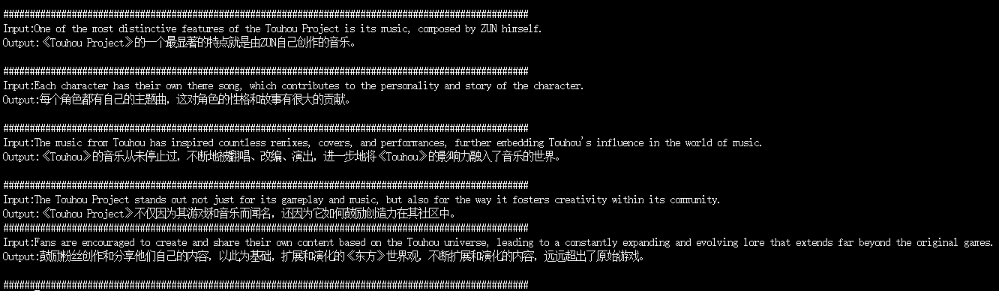
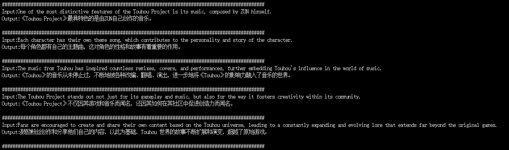

[中文](./README_ZH.md) | English

## What is State Tuning?

State Tuning is a concept born out of the understanding that adjusting prompts can significantly enhance the performance of language models, tailoring them to specific tasks. For example, appending "Let's think step by step" to a math problem can improve accuracy. However, manually tweaking prompts for each task is labor-intensive and results are not guaranteed. This led to the innovative idea of using backpropagation to find/train the most suitable prompts ([Auto Prompt](https://arxiv.org/abs/2010.15980) etc.), which proved to be effective.

Further innovation led some to think beyond just training prompts. Why not train the input embeddings ([P-Tuning](https://arxiv.org/abs/2103.10385) etc.) or even the embeddings of all layers ([P-Tuning v2](https://arxiv.org/abs/2110.07602) etc.)? And for RNNs, why not train the entire state? This is where State Tuning comes into play —— training the RNN's state to enhance model performance.

## Why State Tuning?

- State can represent all conceivable past information, theoretically, offering the strongest capability compared to Prompt Tuning, Prefix Tuning, P-Tuning, etc.
- It does not introduce any additional computation during the inference.
- It allows for the adaptation of the same model to different tasks (unlike fine-tuning).
- Compared to model weights, the state's size is minimal, making it easy to store.
- No catastrophic forgetting.

## Quick Start
### Run the model and load pre-trained state:
```
python3 launch.py --model <RWKV Pre-trained Weights> --state <State Weights>
```
You can try 'weight/3b_en2zh_ckpt12000.pth'; this is a state for the RWKV6 3B model used for English to Chinese translation.

Please adjust the format of the prompt template to match the format used in your training. The original one here is for English to Chinese translation.

### DEMO: Chinese-English Translation Task

Original Model


After Using State Tuning


### Train state:

#### Constructing the Training Dataset

For demonstration or debugging purposes, you can use the following pre-processed dataset files:

- Training set: `data/e2e_train_rwkvtok.jsonl`
- Validation set: `data/e2e_eval_rwkvtok.jsonl`

These datasets originate from the **End-to-End NLG Challenge (E2E)** and have been processed for immediate use in model training.

You can also prepare your own training and validation datasets:

- You can create a JSONL file similar to `data/e2e_train_rwkvtok.jsonl`. Specifically, this is a JSONL file where each line contains a JSON object, including the following two elements:
    1. **Tokenized text data**: A list of integers obtained by processing the original text with the RWKV Tokenizer.
    2. **Mask list**: A list containing 0s and 1s, with the same length as the text data. Positions marked with 1 will have their loss calculated during the training process.

- Alternatively, you can use the `convert_dataset.py` script to convert text datasets into this format:

    First, prepare a file like `data/e2e_train_raw.jsonl`, which should look like this:
    ```
    {"text": "Training sample 1"}
    {"text": "Training sample 2"}
    ```
    Then run the following command to generate the dataset:
    ```
    python3 convert_dataset.py --text_data <path to your dataset.jsonl> --save_path <path where the training dataset will be saved.jsonl>
    ```

#### Starting Training
You can adjust the training configuration in `config.py` under `TrainConfig` and then run:
```
python3 train_state.py
```

Or you can directly set the training parameters in the command line, for example:
```
python3 train_state.py \
    --model_path <path to pretrained model> \
    --model_size <model size (choose from [v6_1b5, v6_3b], refer to config.py)> \
    --train_data <path to training dataset> \
    --val_data <path to validation dataset>
```

## Roadmap

- [ ] Benchmark
- [ ] Exploration of potential improvements
- [ ] Implement training resumption after interruption

## Tried Ideas

- State Encoder (similar to the prefix encoder in prefix tuning). Outcome: Improvement observed.
- Fine-tuning Various Hyperparameters (learning rate, batch size, etc.). Outcome: No significant impact.
- Global State Encoder (instead of having one state encoder per layer as currently implemented). Outcome: Slight degradation.
- Layer-specific Learning Rates. Outcome: No significant impact.
- Fine-tuning Hyperparameters of the State Encoder (encoded dimension, activation functions, etc.). Outcome: No significant impact.
- Providing the Model with a Prompt and using the generated state for initialization. Outcome: Degradation.

## Note

State Tuning is still in its early stages and is far from reaching its ideal state. We believe in the method's vast potential and welcome everyone to participate in the project in various ways.
