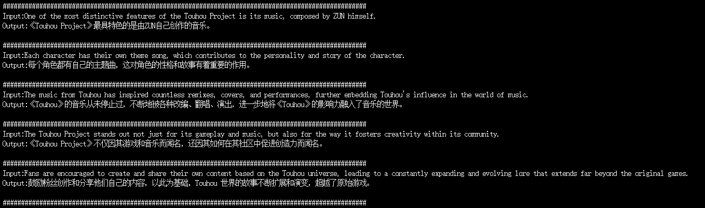

中文 | [English](./README.md)

## 什么是State Tuning？
总所周知，调整提示词可以提升语言模型的性能，使其适应特定任务。例如，在数学题后面加上“让我们一步一步思考”可以提升正确率。

然而，为每个任务手动调整提示词非常耗费人力且难以保证效果。所以一些聪明人想到了使用反向传播来找到/训练最适合的提示词（[Auto Prompt](https://arxiv.org/abs/2010.15980)等），事实证明这很work。

后来，另一些聪明人想到了，相比只训练提示词，为什么我们不直接训练输入embedding（[P-Tuning](https://arxiv.org/abs/2103.10385)等）甚至是所有层的embedding（[P-Tuning v2](https://arxiv.org/abs/2110.07602)等）呢？或者对于RNN来说，我们可以训练整个state，这就是State Tuning——我们训练RNN的state来提升模型的性能。

## 为什么要做State Tuning？
- State可以表达一切可能的过去信息，相比于Prompt Tuning、Prefix Tuning、P-Tuning等方法，有着最强的表达能力。
- 在推理阶段不会带来任何额外计算开销。
- 可以使用同一个模型适配不同任务（相比于微调）。
- 相比于模型权重，state的体积很小，易于存储。
- 没有灾难性遗忘。

## 快速开始
### 运行模型并加载预训练state：
```
python3 launch.py --model <RWKV预训练权重> --state <state权重>
```
你可以尝试“weight/3b_en2zh_ckpt12000.pth”这是一个用于英译中的rwkv6 3b模型的state

注意修改prompt模板的格式使其和你训练使用的格式相同，这里面原始的是用于英译中的。

### DEMO: 中英翻译任务

原始模型


使用了State Tuning后


### 训练state：
#### 训练数据集构造

如果是为了演示或调试目的，，可以使用以下预处理好的数据集文件：

- 训练集：`data/e2e_train_rwkvtok.jsonl`
- 验证集：`data/e2e_eval_rwkvtok.jsonl`

这些数据集源自**End-to-End NLG Challenge (E2E)**，已经过处理，可直接用于state训练。

你也可以准备自己的训练集和验证集：

- 你可以自己构造一个形如`data/e2e_train_rwkvtok.jsonl`的jsonl文件
具体而言它是一个jsonl文件，每一行包含一个JSON对象，包括以下两个元素：
    1. **Token化的文本数据**：使用RWKV Tokenizer处理的原始文本得到的整数列表。
    2. **Mask列表**：一个包含0和1的列表，长度与文本数据相同。标记为1的位置的loss会在训练过程中被计算。

- 也可以使用`convert_dataset.py`将文本类型的数据集转成这种数据集：

    先准备一个形如`data/e2e_train_raw.jsonl`的文件

    也就是说它看起来应该像这样：
    ```
    {"text": "训练样本1"}
    {"text": "训练样本2"}
    ```
    然后运行以下命令来生成数据集
    ```
    python3 convert_dataset.py --text_data <你的数据集路径.jsonl> --save_path <生成的用于训练的数据集的路径.jsonl>
    ```

#### 开始训练
你可以调整`config.py`中`TrainConfig`来修改训练配置，然后运行
```
python3 train_state.py
```

或者直接在命令行中设定训练参数，例如：
```
python3 train_state.py \
    --model_path <预训练模型路径> \
    --model_size <模型大小（从[v6_1b5、v6_3b]中选择，参考config.py）> \
    --train_data <训练集路径> \
    --val_data <验证集路径> \
```

## 路线图

- [ ] Benchmark
- [ ] 探索可能的改进
- [ ] 可恢复的训练

## 尝试过的idea

- state encoder（类似于prefix tuning的prefix encoder）。结果：更好
- 微调各种超参数（学习率、batchsize等）。结果：没有明显影响
- 全局的state encoder（而不是像现在这样每层一个state encoder）。结果：略微更差
- 按层的学习率。结果：没有明显影响
- 微调state encoder的超参数（encoded dim，激活函数等）。结果：没有明显影响
- 给模型一个prompt，并用它生成的state作为初始化。结果：更差

## 注意
- State Tuning还处于非常早期的阶段，远远没有达到理想状态，我们相信这个方法有着巨大的潜力，并欢迎所有人以各种方式参与该项目。